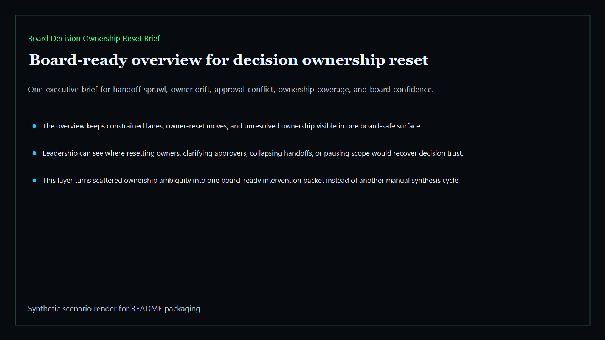
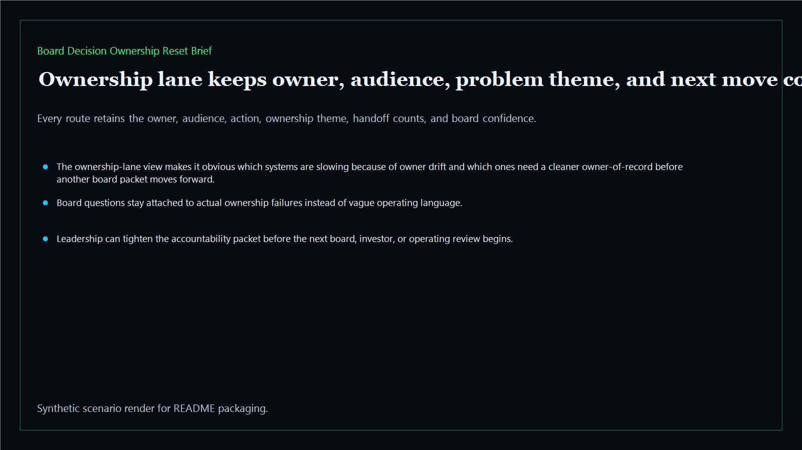
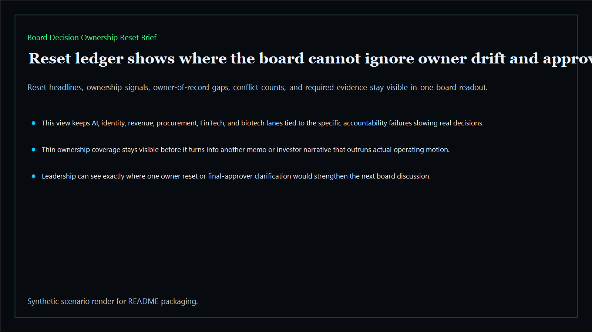
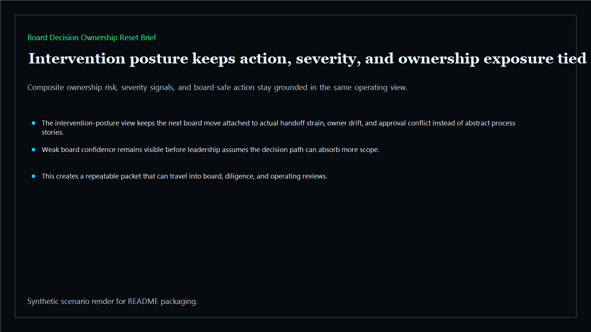

# Board Decision Ownership Reset Brief

Board-ready ownership-reset surface for restoring final decision accountability, escalation clarity, and board-visible intervention paths across the executive estate.

- Live: `https://ownership-reset.kineticgain.com/`
- Repo: `mizcausevic-dev/board-decision-ownership-reset-brief`

## Why this matters

Leaders need more than status labels. They need one surface that shows where final ownership has drifted, which decision chains need a reset, and how accountability can be restored before board confidence drops further.

## What it includes

- TypeScript executive-intelligence surface for ownership resets with modeled routing lanes, final-owner drift, accountability repair, and board-safe intervention posture
- synthetic executive lanes across AI, identity, revenue, FinTech, biotech, procurement, and public-sector readiness
- reusable outputs for escalation lanes, handoff ledgers, intervention packets, and board-ready operating memos
- prerendered static site, JSON payloads, screenshots, and docs

## Product depth

This is the ownership-repair layer for executive decisions. It is designed for leaders who need to know where final accountability has drifted, why the current committee path is not enough, and what reset action restores a board-trustworthy owner path.

- **Buyer value:** gives CEOs, operating partners, and board committees a clear map of where responsibility diffusion is slowing decisions or weakening the investor story.
- **Technical proof:** turns handoff sprawl, unresolved owners, approval conflict, ownership coverage, and confidence scores into static pages, API routes, and repeatable CLI output.
- **GTM story:** frames Kinetic Gain as the executive intelligence layer that converts vague accountability concerns into specific owner-reset motions.

## What these repos have in common

Kinetic Gain executive-intelligence repos use the same proof pattern: structured sample data, deterministic scoring, board-readable pages, CLI output, API routes, prerendered static assets, screenshots, and verification notes. The goal is not another generated landing page. The goal is a repeatable decision packet that a non-technical executive can understand and a technical reviewer can inspect.

## Operating workflow

1. Normalize each decision lane into owner, audience, ownership theme, handoff pressure, and reset action.
2. Score accountability risk from unresolved ownership, approval conflict, coverage gaps, and board-confidence strain.
3. Produce the board-facing intervention path: reset owner, clarify approver, collapse handoff, or pause scope.

## Routes

- `/`
- `/ownership-lane`
- `/reset-ledger`
- `/intervention-posture`
- `/verification`
- `/docs`

## Local run

```bash
cd board-decision-ownership-reset-brief
npm install
npm run verify
npm run prerender
npm run render:assets
```

## CLI

```bash
npx board-decision-ownership-reset-brief fixtures/board-decision-ownership-reset-brief.json --format summary
npx board-decision-ownership-reset-brief fixtures/board-decision-ownership-reset-brief-clean.json --format json
```

## Docs

- [Architecture](docs/architecture.md)
- [Origin](docs/ORIGIN.md)
- [Kinetic Gain Embedded](docs/KINETIC_GAIN_EMBEDDED.md)

## Screenshots





